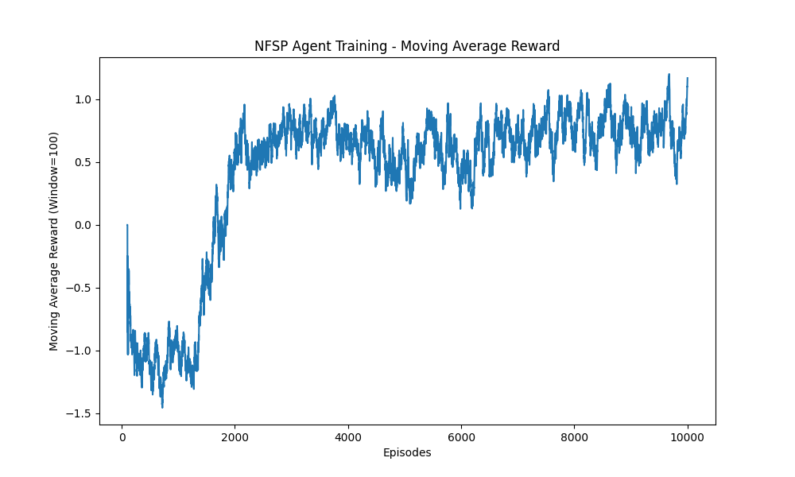

<div align="center">
<h1>Neural Fictitious Self-Play</h1>

</div>

Welcome! This repo implements the Neural Fictitious Self-Play (NFSP) algorithm. A method that
combines Reinforcement Learning and Supervised Learning to train agents in multi-player environments.
This method was developed mainly for 2-player imperfect information games.

I completed this project for my gymnasium project over a couple of weeks. If you have any questions or suggestions, feel free to reach out to me or open an issue.

The repo we have showcases a true-to-paper implementation of the algorithm (with minor network tweaks
like SGD substitution). We also have a basic Kuhn Poker implementation (also a nash equilibrium player
for the game).

Feel free to explore, use the code as you see fit, and reach out with questions or suggestions.



Above is a sample plot of the training process of an NFSP agent in a Kuhn Poker environment. This is the average reward over the episodes against a Nash Equilibrium player.

## Installation

I use `poetry` for dependency management. If you don't have it installed, you can install it by following the instructions [here](https://python-poetry.org/docs/).

It is recommended to use a virtual environment to install the dependencies. You can do so by running the following commands:

```sh
git clone https://github.com/Troreen/Neural-Fictisious-Self-Play
cd Neural-Fictitious-Self-Play
poetry install
poetry shell
```

## Quick Start

To dive straight into training an NFSP agent in a game environment, you can use the following command:

```sh
python src/nfsp_train.py
```

Training progress can be visualized through plots saved in the `plots` directory, and models will be saved in the `models` directory. While logs aren't currently saved, you can easily add logging functionality by modifying the nfsp_train.py file.